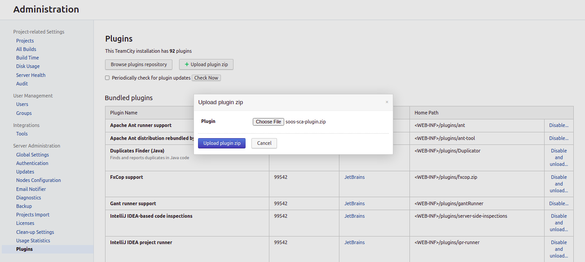

# SOOS SCA Plugin

SOOS is the affordable, easy-to-integrate Software Composition Analysis solution for your whole team.

## Features
- Scan your Open Source Software, Webapps and Containers for vulnerabilities
- Ease of integration (run your first scan in minutes or get your first scan results within minutes)
- Control the introduction of new dependencies and vulnerabilities
- Exclude unwanted license-types
- Detect and prevent dependency substitutions and typo-squatting
- Generate SBOMs
- Fill out your compliance worksheets with confidence
- Simple and affordable pricing. Only one plan that includes every feature we offer plus unlimited projects, unlimited users, and no scan limits.

## How to Use

The **SOOS SCA Plugin** will locate and analyze any supported manifest files under the specified directory.

To use SOOS SCA Plugin you need to:

1. [Install the SOOS SCA Plugin](#install-the-soos-sca-plugin)
2. [Configure authorization](#configure-authorization)
3. [Select the mode](#select-the-mode)
4. [Configure other plugin parameters](#configure-other-plugin-parameters)

## Supported Languages and Package Managers

*	[Node (NPM)](https://www.npmjs.com/)
*	[Python (pypi)](https://pypi.org/)
*	[.NET (NuGet)](https://www.nuget.org/)
*	[Ruby (Ruby Gems)](https://rubygems.org/)
*	[Java (Maven)](https://maven.apache.org/)

Our full list of supported manifest formats can be found [here](https://kb.soos.io/help/soos-languages-supported).

## Need an Account?
**Visit [soos.io](https://app.soos.io/register) to create your trial account.**

## Setup

### Install the SOOS SCA Plugin

Install or upgrade the SOOS SCA Plugin from Jetbrains Marketplace with these steps. Once complete, you’re all set to add a SOOS SCA step to your projects.

Log in to your TeamCity instance to install the SOOS SCA Plugin. Configure the Plugins list to Periodically check for plugin updates, in order to ensure regular automatic upgrades in the background. Navigate to the JetBrains Plugins Repository, search for **SOOS SCA** and from the Get dropdown list, select to install the plugin for your TeamCity installation. When the following prompt appears, click Install. When the installation ends, the Administration Plugins List loads, notifying the plugin has been uploaded. Ensure the plugin is enabled.

<blockquote style="margin-bottom: 10px;">

 Show example 

</blockquote>

To manually install the plugin you have two options:

1.  Download and copy the .zip file into <teamcity-home>/plugins/. Restart the teamcity server. 
2.  Download the .zip file, log in to your TeamCity instance, go to Administration > Plugins, and click the "Upload plugin zip" button, choose the **soos-sca-plugin.zip** file, when the following prompt appears, click Upload plugin zip. Ensure the plugin is enabled.

<blockquote style="margin-bottom: 10px;">

 Show example 

</blockquote>

### Configure authorization

**SOOS SCA Plugin** needs environment variables called **system properties (system.)** in teamcity which are passed as parameters. These system properties have to be declared as Parameters inside the project or the build settings, and they are required for the plugin to operate.

| Property | Description |
| --- | --- |
| system.SOOS_CLIENT_ID | Provided to you when subscribing to SOOS services. |
| system.SOOS_API_KEY | Provided to you when subscribing to SOOS services. |

These values can be found in the SOOS App under Integrate.

### Select the mode

#### Run and wait for the analysis report
Set the **Mode** parameter to *Run and wait*, then you can run the plans in your CI/CD, and wait for the scan to complete.

#### Start the Scan
Set the **Mode** parameter to *Async init*, if you don't care about the scan result in your CI/CD plan, this is all you have to do!

#### Wait for the Scan
If you care about the result or want to break the build when issues occur, add a second task close to the end of your plan to give the scan as much time as possible to complete, setting the **Mode** parameter to *Async result*.

### Configure other plugin parameters

<blockquote style="margin-bottom: 10px;">

 Show parameters 

| Select/Inputs | Default | Description |
| --- | --- | --- |
| Project Name | ""  | REQUIRED. A custom project name that will present itself as a collection of test results within your soos.io dashboard. |
| Mode | "Run and wait"  | Running mode, alternatives: "Async init" - "Async result" |
| On Failure | "Fail the build"  | Stop the building in case of failure, alternative: "Continue on failure" |
| Operating System | "Linux"  | System info regarding operating system, etc., alternatives: "Windows" - "MacOS" |
| Analysis Res. Max Wait | 300  | Maximum seconds to wait for Analysis Result before exiting with error. |
| Analysis Res. Polling Interval | 10  | Polling interval (in seconds) for analysis result completion (success/failure.). Min 10. |
| Directories To Exclude | ""  | List (comma separated) of directories (relative to ./) to exclude from the search for manifest files. Example - Correct: bin/start/ ... Example - Incorrect: ./bin/start/ ... Example - Incorrect: /bin/start/'|
| Files To Exclude | ""  | List (comma separated) of files (relative to ./) to exclude from the search for manifest files. Example - Correct: bin/start/manifest.txt ... Example - Incorrect: ./bin/start/manifest.txt ... Example - Incorrect: /bin/start/manifest.txt' |
| Commit Hash | ""  | The commit hash value from the SCM System |
| Branch Name | ""  | The name of the branch from the SCM System |
| Branch URI | ""  | The URI to the branch from the SCM System |
| Build Version | ""  | Version of application build artifacts |
| Build URI | ""  | URI to CI build info |

</blockquote>

## Feedback and Support
### Knowledge Base
[Go To Knowledge Base](https://kb.soos.io/help)

